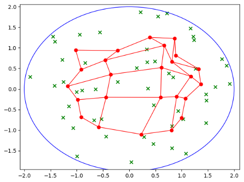
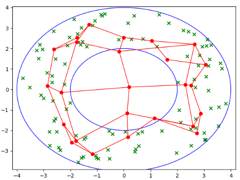

## Kohonen-Algorithm

This project shows the operation of the Kohonen algorithm also known as self-organizing maps.

## Process

The algorithm learns and clusters with respect to all provided examples. 
Our examples were random and had the boundaries of the selected figure: a circle or a ring.

